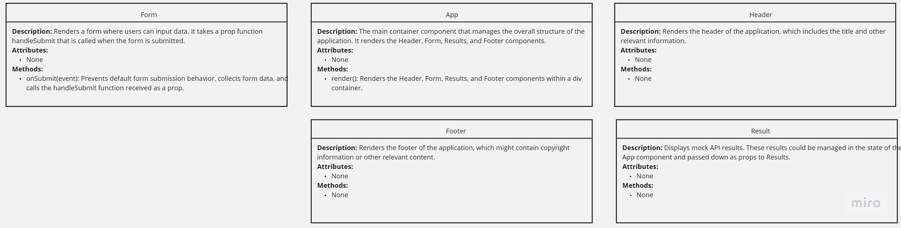
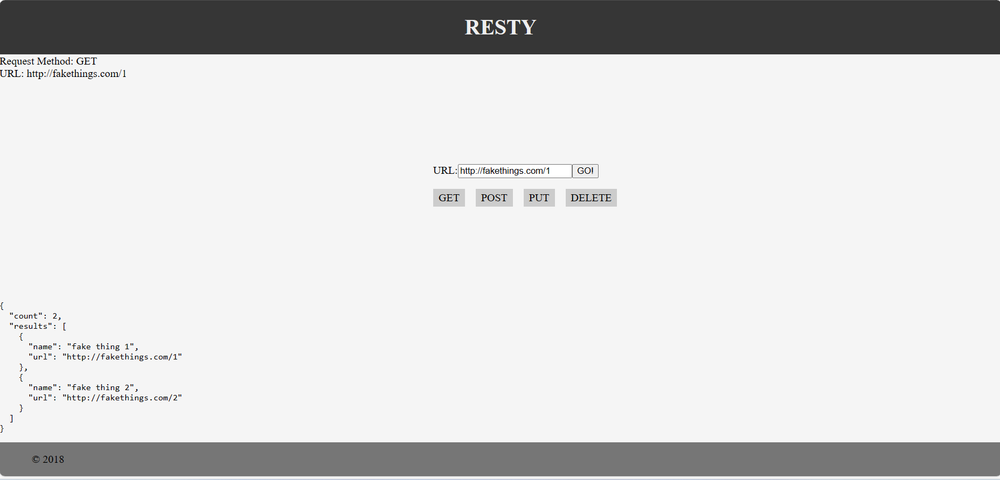

# resty

resty Explorer is a web application that allows users to explore information about Pokémon species using the resty. Users can search for specific Pokémon, view their details, and discover their abilities, types, and evolutions. The application provides an intuitive interface to interact with the vast amount of data available in the resty.

## UML

## Usage
To use the PokeAPI Explorer:

* Homepage: When you open the application, you'll be greeted with a search bar where you can enter the name of a Pokémon you want to explore.
* Search: Type the name of a Pokémon (e.g., "Pikachu") and click the "Search" button.
* Results: The application will display information about the Pokémon, including its types, abilities, and evolutions.

## Components

* Header: Displays the application title and navigation.

* Form: Allows users to input a Pokémon name and trigger the search.

* Results: Displays the fetched data about the Pokémon.

* Footer: Displays copyright information.

## Component Hierarchy

## Technologies Used
The rsety is built using the following technologies:

* React

## License
This project is licensed under the MIT License.